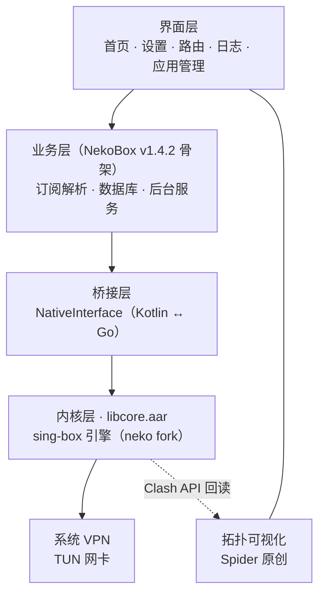
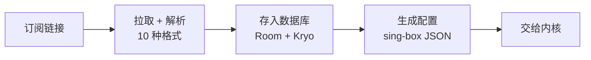

# Spider 架构说明

> 版本：2026-09-17
> 范围：工作区根 `D:\workspace\Spider\` + Android 子工程 `Spider-android/`
> 读者：维护者 / Reviewer / 新加入的工程师
> 说明：本文档基于**实际代码核实**编写，与 `project-structure.md` 描述不一致之处，**以本文为准**（原因见 §6）。

---

## 1. 项目血统（必读）

Spider 的 Android 工程**换过一次血统**，这是理解整个项目的前提。

```
官方 sing-box（SagerNet，Go 内核，本身没有 UI）
│
├── 内核线 A：官方 SagerNet/sing-box
│     └── 客户端 SFA（sing-box-for-android）
│           包名 io.nekohasekai.sfa · Jetpack Compose · 扁平 Profile
│           ← Spider 第一代基于此（≤ 2026-08-27 上午）
│
└── 内核线 B：MatsuriDayo/sing-box（neko fork）
      │   相对官方多出：nekoutils 钩子 / boxapi / command_clash_mode
      └── 客户端 NekoBox for Android（NB4A）
            包名 io.nekohasekai.sagernet · View/XML · ProxyEntity Bean · Kryo
            ← Spider 第二代基于此（2026-08-27 晚起，当前）
```

### 决定性证据

提交 `76b4e2d`（2026-08-27 20:31:54）：

```
Migrate Android codebase to NekoBox v1.4.2 with Spider branding
1351 files changed, 49235 insertions(+), 114466 deletions(-)
```

- 该提交**删除 207 个 `io/nekohasekai/sfa/` 文件**（含 `vendor/`、`aidl/`）
- 父提交 `2f9e103` 的包结构为 `io/nekohasekai/sfa`（SFA 血统）
- 当前包结构为 `io/nekohasekai/sagernet` + `moe/matsuri/nb4a`（NekoBox 血统）

### 当前架构实证

| 项目 | 实际值 |
|------|--------|
| 代码包名 | `io.nekohasekai.sagernet` |
| Application 类 | `SagerNet.kt` |
| applicationId | `moe.nb4a`（`nb4a.properties`） |
| UI 框架 | **View/XML + Fragment/Activity**（44 个 layout，**零 Compose 依赖**） |
| 数据模型 | `ProxyEntity` Bean + **Kryo** 序列化 + Room |
| 订阅解析 | `fmt/` 下 10 种协议解析器 |

---

## 2. 分层结构



### 各层来源

| 层 | 主要来源 | 备注 |
|----|---------|------|
| 界面层 | NekoBox | 除拓扑可视化外，均为 NekoBox v1.4.2 原码 |
| 业务层 | NekoBox | `fmt/`、`database/`、`bg/`、`group/` |
| 桥接层 | NekoBox | `moe/matsuri/nb4a/NativeInterface.kt` |
| 内核层 | **neko** | `libcore/` + neko 的 sing-box fork，编译为 `libcore.aar` |
| 拓扑可视化 | **Spider 原创** | `ui/topology/`，12 个文件 |

---

## 3. 运行时数据流

### 3.1 主调用链

**界面层 → 业务层 → 桥接层 → 内核层 → 系统 VPN → 网络**

用户操作自上而下传递，最终由内核层启动引擎、经 TUN 网卡转发流量。

### 3.2 配置流



### 3.3 回读链路（拓扑可视化）

内核运行后通过 **Clash API** 对外提供实时状态，拓扑界面反向读取并绘制：

- 数据源：官方 `experimental/clashapi` 的 `/connections` 与 `/rules` 端点
- 实现：`ui/topology/ClashApiClient.kt`（HTTP / WebSocket）
- 失败处理：`ClashResult` 为密封接口，**失败不抛异常**；"用户未开启 Clash API" 属**配置状态**而非错误，界面应给"跳设置"入口
- `RuleSignature.isBuiltin`：区分「内核自带规则」与「用户规则」
- `TopologyView`：刻意做得很薄，只回答"点到了哪个对象"（`TopologyHit`），命中判定在 `labelAt` 内部完成，**不向外抛事件**

> **重要**：拓扑可视化走的是**官方 Clash API**，与 neko 无任何关系。任何"去 neko"改造都**不影响**该功能。

---

## 4. 内核依赖：neko 相对官方 sing-box 的改动

### 4.1 neko 的全部原创改动

| 改动 | 文件 | 规模 | 日期 |
|------|------|------|------|
| selector 回调钩子 | `nekoutils/callback.go`(新) + `protocol/group/selector.go` | 3 + 4 行 | 2025-02-23 |
| geoip/geosite 钩子 | `nekoutils/srs.go`(新) + `route/rule/rule_set_local.go` | 7 + 23 行 | 2025-02-26 |
| boxapi 模块 | `boxapi/`（官方无此目录） | 4 文件 | 2024-07-02 |
| clash 模式选择器 | `experimental/libbox/command_clash_mode.go`(新) | 1 文件 | 2023-08-24 |
| DoNotSelectInterface | `common/dialer/default.go` | 4 行 | 2025-02-23 |
| vless mux 时禁用 flow | `outbound/vless` | — | 2024-10-09 |
| 杂项修复 | gvisor close / needCacheFile / Tailscale | — | — |

> **所有 `-neko-N` 提交只改 `constant/version.go` 一行**（已逐一验证 8 个提交）。它们是纯版本号标记，无功能改动。

### 4.2 钩子机制

neko 在核心里放**空的函数变量**，由客户端注入实现：

```go
// 1. neko 在核心里声明空变量（nekoutils/callback.go）
var Selector_OnProxySelected func(selectorTag string, tag string)

// 2. 核心在关键点调用（protocol/group/selector.go）
if nekoutils.Selector_OnProxySelected != nil {
    nekoutils.Selector_OnProxySelected(s.Tag(), tag)
}

// 3. 客户端赋值实现（libcore/nb4a.go:68）
nekoutils.Selector_OnProxySelected = intfNB4A.Selector_OnProxySelected
```

这是**插件式解耦**：核心只留接口，客户端注入实现。

### 4.3 Spider 对每个改动的实际使用情况

| 改动 | 是否在用 | 证据 |
|------|---------|------|
| geoip/geosite 规则注入 | ✅ **在用（核心）** | `libcore/geoip.go`、`geosite.go`；设置项 `rulesProvider`（4 个规则源） |
| selector 换节点回调 | ✅ **在用** | `NativeInterface.kt:84-104`（重置连接 + 通知标题 + `cbSelectorUpdate` 广播） |
| `boxapi` 流量统计 | ✅ **在用** | `TrafficLooper.kt:134` → `setV2rayStats`；`TrafficUpdater.kt:32-33` → `queryStats` |
| `boxapi` 测速 | ✅ **在用** | `BaseService.kt:171` → `Libcore.urlTest`；`TestInstance.kt:34` |
| `dialer.DoNotSelectInterface` | ✅ **在用** | `libcore/box.go:32` → 置为 `true` |
| `command_clash_mode.go`（模式开关） | ❌ **未使用** | Kotlin 与 `libcore/` 均零引用 |

### 4.4 完整依赖清单（改造时的工作量基线）

**内核侧（经 `replace` 指向 neko fork）**

| 依赖 | 位置 | 点数 |
|------|------|------|
| `nekoutils.GetGeoIPHeadlessRules` | `libcore/geoip.go:62` | 1 |
| `nekoutils.GetGeoSiteHeadlessRules` | `libcore/geosite.go:47` | 1 |
| `nekoutils.Selector_OnProxySelected` | `libcore/nb4a.go:68` | 1 |
| `boxapi.SbV2rayServer` | `libcore/box.go:77,195` | 2 |
| `boxapi.CreateProxyHttpClient` | `libcore/box.go:224,228,234` | 3 |
| `//go:linkname constant.resourcePaths` | `libcore/nb4a.go:21` | 1 |

**libneko 侧（独立仓库）**

| 模块 | 用途 | 点数 |
|------|------|------|
| `neko_common` | `RunMode` 标志位 | 1 |
| `neko_log` | 日志 | 5 |
| `protect_server` | `ServeProtect` | 1 |
| `speedtest` | `UrlTest` | 3 |

> **合计约 20 个调用点。** 规模很小。

### 4.5 改造可行性要点（供后续决策参考）

- **`boxapi` 只用公开接口**（`adapter` / `common/dialer` / `option` / 根包），可整体搬迁到自有项目，**无需修改内核**。
- **geoip/geosite 可在 libcore 内提前展开**：`libcore/box.go:95` 在创建 box 前已自行 `options.UnmarshalJSONContext`，可在该处把 `rule_set.path = "geoip:xx"` 展开为 inline 规则，从而**不修改内核**。
- **读取器与转换器是官方自带**：`common/geosite`、`common/geoip` 均存在于官方 sing-box，neko 只补了"递交通道"。
- 真正需要内核补丁的仅 **selector 回调** 与 **DoNotSelectInterface**（各约 4 行）。

---

## 5. 构建链

```
sing-box-matsuri/  (neko fork, 1.12.19-neko-1)  ─┐
libneko/                                        ─┼─ replace ─→ libcore/ ──gomobile bind──→ libcore.aar
gomobile-src/                                   ─┘                              ↓
                                                                    app/libs/libcore.aar
                                                                              ↓
                                                                    Gradle 打包 → APK
```

`Spider-android/libcore/go.mod`：

```go
replace github.com/matsuridayo/libneko => ../../libneko
replace github.com/sagernet/sing-box   => ../../sing-box-matsuri
replace github.com/sagernet/gomobile   => ../../gomobile-src
```

- 版本号占位符（`v1.0.0 // replaced`）**无实际作用**，真实版本由三个目录的 git 状态决定。
- `libcore/build.sh` 用 `gomobile-matsuri bind` 产出 `libcore.aar`，末尾自动 `cp -f libcore.aar ../app/libs`。
- **这三个目录是构建硬依赖，不可删除。**

### 升级策略

- 升级 = **切换 `sing-box-matsuri/` 的 git 分支/commit**，不改任何 `go.mod` 版本号。
- 必须**等 neko 发版**（目标：下一个 `x.y.z-neko-1`）。官方 release 只作"上游在动"的信号。
- 现状：neko 停在 `1.12.19-neko-1`（2026-02-02），官方已至 1.13/1.14+，**落后约 7~9 个月**。
- ⚠️ 当前 `git fetch` 到 github.com 报 SSL 错误，升级前需先解决网络/代理。

---

## 6. 与 `project-structure.md` 的关系

`docs/project-structure.md`（版本标注 2026-08-27 11:37）与 `docs/before-after-report.md`（11:39）**写于血统迁移前约 9 小时**。

因此它们描述的是**第一代（SFA / Compose）**架构，其中：

- 「Jetpack Compose」「`io.nekohasekai.sfa`」「`libbox.aar`」等描述在**写作当时是准确的**，但**现已过时**
- 文档中 H1 决策「不做 NekoBox 源码整体替换」**当晚即被 `76b4e2d` 推翻**
- 文档中 `sing-box-reference/`、`tools/windows/download-singbox.ps1`、`.trae/` 等条目**从未落地**

**结论：以本文档为准。** 旧文档保留作为历史记录，不建议据此判断现状。

---

## 7. 已知问题（待处理）

| 问题 | 说明 |
|------|------|
| `sing-box-src/` 占仓库 68% 追踪文件 | 1231 个文件 / 92MB，含 87MB 预编译 AAR，**未被 `.gitignore` 忽略** |
| `docs/SINGBOX_UPGRADE_GUIDE.md` 未覆盖源码级升级 | 431 行中无 `replace`/`gomobile`/`libcore`/`go.mod` 字样，且版本历史表与实际不符 |
| `libcore/.gitignore` 写法有误 | `*.[a|j]ar` 中 `[a|j]` 等价字符集 `{a,\|,j}`，非 `{a,j}`（当前未致错） |
| 根 `.gitignore` 含无效条目 | `tools/` 被忽略但目录不存在 |
| 三个 replace 目录未纳入版本库 | 新克隆仓库无法直接编译 `libcore` |
